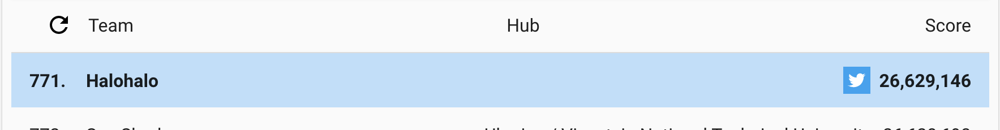

# Google Hash Code 2020
This repository aims at sharing [Google Hash Code 2020](https://codingcompetitions.withgoogle.com/hashcode) program codes.

---
## Practice
This practice problem gives the target number of slice and a list of numbers of pizza slices.
It aims at finding the combination of pizzas with most of slices equal or close to the target.

The below is the result of my program `practice.py`. Explanation has been documented inside the program.

| Problem | Score |
| ------- | ----- |
| a_example.in | 16 |
| b_small.in | 100 |
| c_medium.in | 4500 |
| d_quite_big.in | 1000000000 |
| e_also_big.in | 505000000 |

---
## Online Qualification Round
On 21st Feb 2020, the real battle started. After an introduction for half an hour, the problem statement released
and our muscle got tension. The problem requires us to borrow books as much score as possible from a list of library
with various blocking periods before shipping books from the libraries.

Unlike the practice problem, this one does not seeem able to find the most optimized solution with polynomial time.
Thefore, we decided to utilize estimation scoring to sort the library sequence.

The below is the final result of my program `qualification_round_2020.py` in extended round. 
Explanation has been documented inside the program.

| Problem | Score |
| ------- | ----- |
| a_example.txt | 21 |
| b_read_on.txt | 5,822,900 |
| c_incunabula.txt | 5,645,747 |
| d_tough_choices.txt | 4,815,395 |
| e_so_many_books.txt | 5,104,922 |
| f_libraries_of_the_world.txt | 5,240,161 |

__Total score: 26,629,146. Global ranking: 771. Egypt ranking: 12. Germany ranking: 59. Hong Kong ranking: 3.__

Let me share my lessons learnt for every participant to prepare your next competition.

### Teamwork
Unlike typical programming competitions, Hash Code is joined with teams of 2 to 4 members.
You do not only work with multiple team members, but also compete with other teams with multiple
people, thus multiple brains.

If you form a team with well familiar friends or classmates, the team could run much efficiently.
If you form with newly made friends, you have to think about how to interact closely.

1. Communication Tool: Google provided Hash Code in Facebook for participants to look for
team members. After a team is formed, Facebook or Messenger does not deliver messages in timely
basis. You may consider mobile, Whatsapp or Telegram.

2. Code Sharing: You would exchange codes or ideas before or during the competition. Whatsapp or
Telegram is good for short messages but not for a large piece of codes. Shared Folder in Google
Drive and even Slack can help.

3. Coding Practice: You would work as a team. Your code should not only known to yourself but 
also understood by team members. Clear comments and readable naming convention make team members
follow and support each other much easily.

### Preparation
Warm-up is necessary for any game. Competitive programming is no exception. Although you never
know the exact question and pattern, you could prepare the following to help yourselves pick up
and save your valuable time.

1. Programming Language: Select a programming language and agree with the team. You are not necessarily
worried with the marginal speed of a programming language (Assembly? come-on). Although the given
data set could be huge, a good solution can decisively resolve it even in seconds. The most importance
is consensus within the team.

2. Skeleton: If you revise past problem statements, you would find that the input and the output data set
look quite similar. This means that you could prepare a code boilerplate beforehand. The boilerplate
is obviously helpful when the competition time is so tight. For Python 3 reference, I have prepared 
a boilerplate code `skeleton.py`.

3. Practice Leads Perfect: Thanking Google for sharing past problem statements and rankings, you 
could practise data structures and algorithms, adjust strategy and pay more attention to higher priority 
during revision.

### Count Down
Competition was exciting. I did not find any time to take a breathe until the game ended. You should
consider the following to make use of your time better.

1. Shorter file names: Time is so valuable. You should balance between readability and typing time.
It does matter when you keep running, debugging and revising during the competition.

2. Decisive: Again, time is so valuable. A good solution can resolve a huge data set in seconds. If
your code run over minutes, you should decide to revise your code indeed. Common time killers are
nested loop which spends O(n^2) and loophole in data pattern beyond your estimation. Don't be afraid
to get rid of slow codes.

3. Be open: As long as your code can resolve all data set, your code is a good code. You should not
necessarily limit your code with a single algorithm only. Like the code shared here, it includes three
algorithms together. It takes one of them based on the best estimation sudject to a given situation or 
data set dynamically.

---
## Acknowledgement
I would like to say "Thank You" again to Jonathan Janetzki and Mohamed Abdel Nasser. It was so amazing
for us to work for such an exciting activity from three different continents together. I wish we all had 
great fun in this game.

---
## Author
- Teki Chan *tekichan@gmail.com*